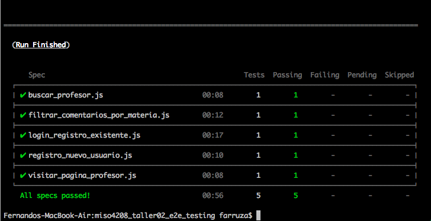
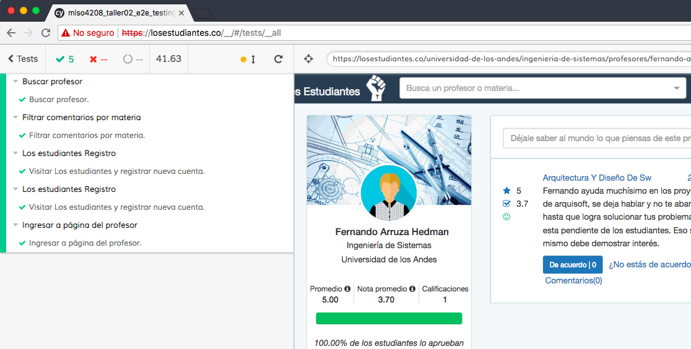
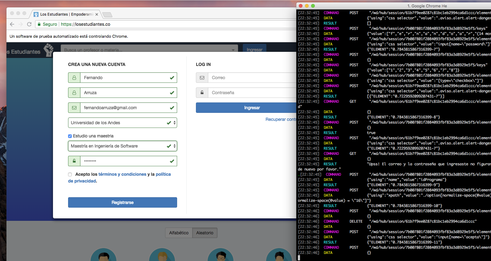
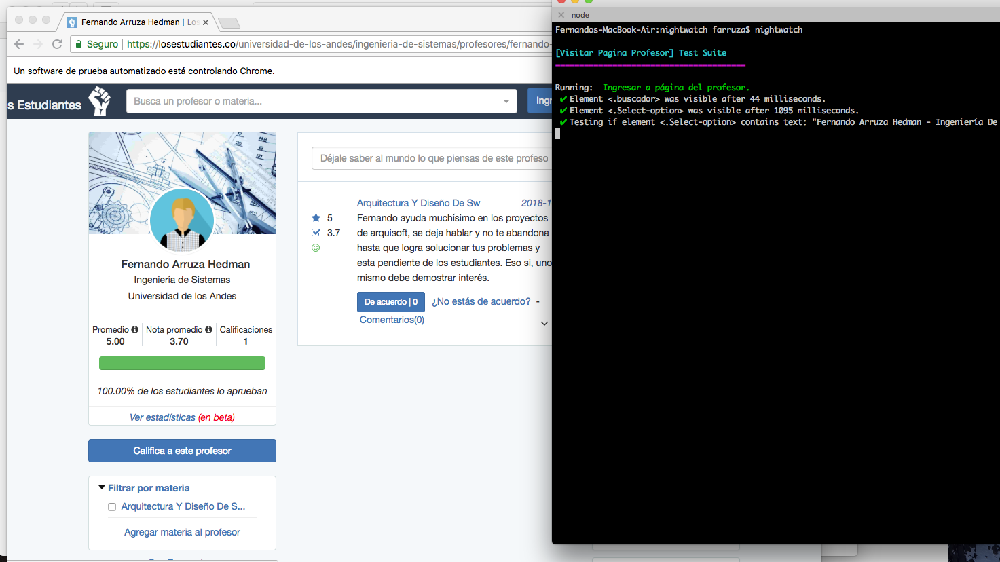
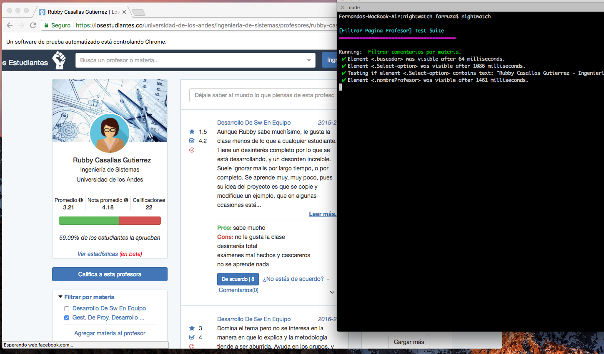

# TALLER 2 y 3: E2E Testing / Headless Testing.

## Taller 3 :: Headless Testing
## Cypress

## Taller 2 :: E2E Testing
## Cypress
### Registrar nueva cuenta

### Iniciar sesión

### Intento de registro de cuenta ya existente

### Buscar profesor

### Ingreso a perfil de profesor

### Filtrar comentarios por Materia

## Protractor
### Ejecución de pruebas

## Webdriver.io
### Ejecución de pruebas

## Nightwatch.js
### Ejecución de pruebas

